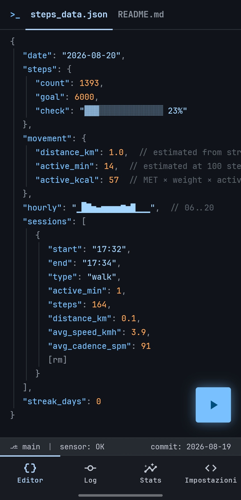
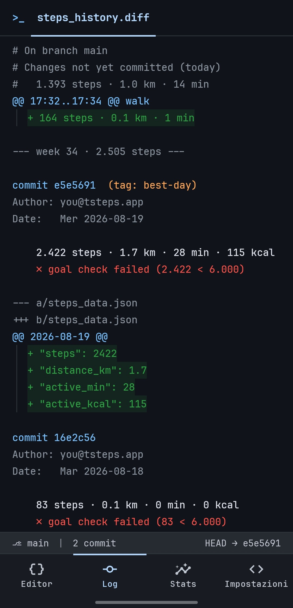
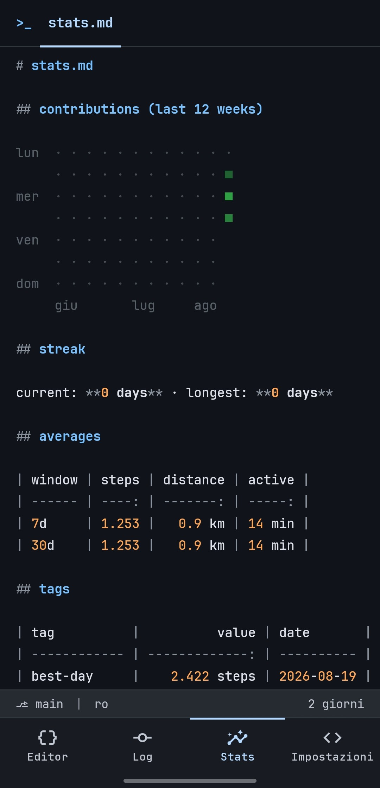
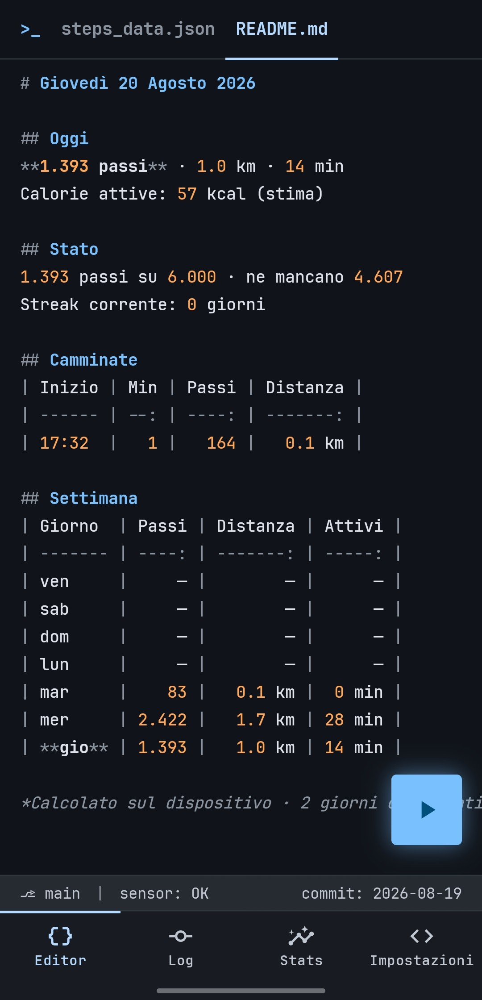
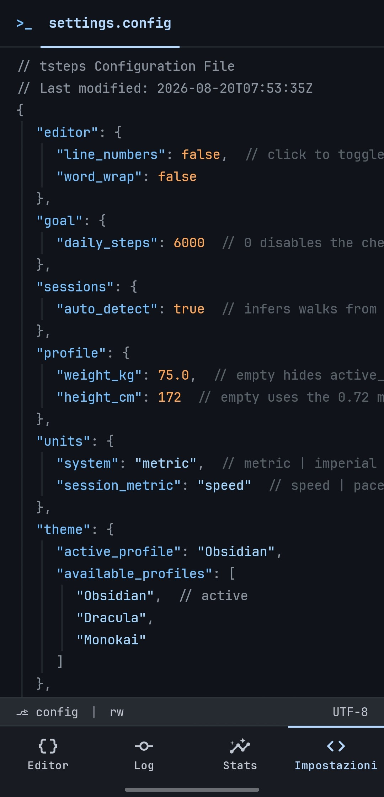
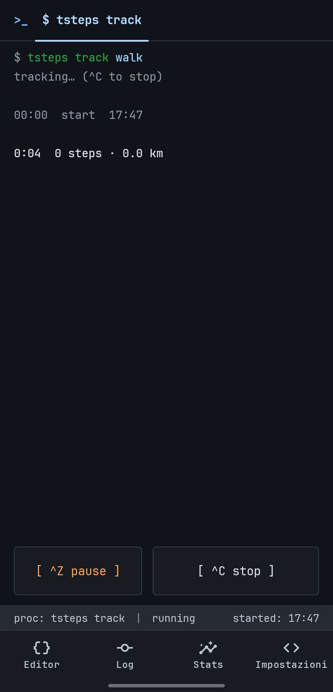
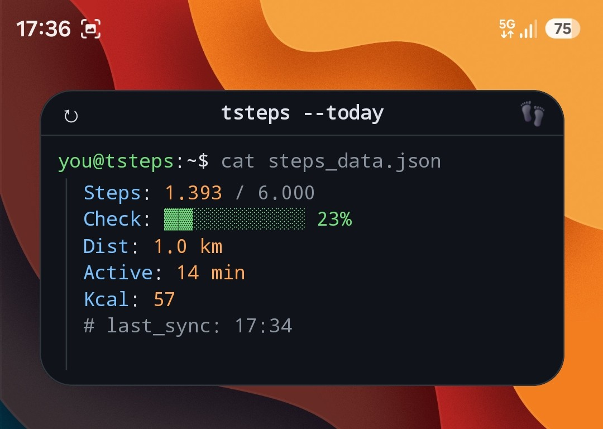

# tsteps

[](https://github.com/fiorenzobrioni/tsteps/actions/workflows/android-ci.yml)


**A step counter that thinks it is a git repo.**

Every day is a commit. Your steps are the added lines, a walk is a diff hunk with
its time range in the `@@` header, the daily goal is a CI check that passes or
fails, and your streak is a contribution graph. The word "commit" means exactly
what it says: showing up every day.

tsteps is the second app of the t-series, after
[tweather](https://github.com/fiorenzobrioni/tweather) ("a weather app that thinks
it is a code editor"). Same fake-editor interface, same Obsidian Syntax theme, same
JetBrains Mono everywhere: the two apps look like two files open in the same editor.

| `steps_data.json` | `steps_history.diff` | `stats.md` |
|:---:|:---:|:---:|
|  |  |  |

---

## The idea

The bottom bar has four tabs, and each one opens a file rather than a screen.

### `steps_data.json`: today

The working tree. The step count ticks live while you watch, because the file is
being written all day. The `//` comments are the status channel: sensor state,
estimate disclaimers and errors read like compiler messages, not toasts.

```json
{
  "date": "2026-08-18",
  "steps": {
    "count": 8432,
    "goal": 10000,
    "check": "▓▓▓▓▓▓▓▓▓▓▓▓▓░░░ 84%"
  },
  "movement": {
    "distance_km": 6.1,   // estimated from stride length
    "active_min": 74,     // estimated at 100 steps/min
    "active_kcal": 327    // MET × weight × active time
  },
  "hourly": "▁▁▂▅▇▇▃▁▁▂▅▃▁▁",   // 06..20
  "sessions": [
    {
      "start": "09:32",
      "end": "10:18",
      "type": "walk",
      "active_min": 46,
      "steps": 4820,
      "distance_km": 3.4,
      "avg_speed_kmh": 4.4,
      "avg_cadence_spm": 92
      [rm]
    }
  ],
  "streak_days": 6
}
```

Switch to imperial and the keys change too, to `distance_mi`. A JSON file should
not lie about its units. Calories are hidden until you give the app your weight:
an estimate without its input is not shown, it is invented.

### `README.md`: the day in prose

A second editor tab, in the place an editor would put it. The same day as the
JSON, written for a human and fully localized (it is prose, so here even the
headings translate): `## Oggi` with the totals, `## Stato` as the day's build
badge (goal progress in neutral words, never guilt), the walks table, and
`## Settimana` with the last seven days, today in bold and still moving, untracked
days marked with a placeholder dash (missing data, not zero). Sensor problems show up as `>` warning
blockquotes. The active tab survives restarts, and `$ git restore settings.config`
does not touch it: which file is open is editor state, not a setting.



### `steps_history.diff`: the log

One commit per day, committed at midnight by the system. Today sits on top as
uncommitted changes. Expand a day and the walks appear as hunks; personal records
are tags pinned to their commit.

```diff
commit 4f82a1c  (tag: best-week)
Author: you@tsteps.app
Date:   Sun Aug 17

    11,204 steps · 8.3 km · 96 min
    ✓ goal check passed (11,204 ≥ 10,000)

@@ 09:12..10:03 @@ walk
+ 5,120 steps · 3.6 km · 51 min
```

The goal check is factual, never guilt-driven: a red ✗ states a number, and if no
goal is set no check runs at all. The app is fully functional without one.

### `stats.md`: the contribution graph

Your movement as a GitHub-style heatmap, rendered as a markdown file: twelve weeks
of green squares, the current and longest streak, 7 and 30 day averages, and the
records table. Intensity buckets are relative to your own history, not to a
universal 10,000.

### `settings.config`: the settings

Booleans flip on tap, numbers open a terminal prompt, the trailing hint tells you
the allowed values. Resetting is a command with a two-tap confirm:
`$ git restore settings.config`. Two more commands sit at the bottom of the file,
`$ tsteps export --json` and `$ tsteps export --csv`, and print what they wrote
right under themselves (see [Export](#export)).



### `$ tsteps track`: a walk, live

The glowing FAB starts a manual session, which runs as a terminal process: one
transcript line per minute, pause with `^Z`, stop with `^C`. The closed session
becomes a hunk in today's diff.

Walks can also find themselves. An opt-in detector (off by default) rereads the
counter samples the app already collects and turns sustained stretches of walking
cadence into sessions marked `(auto)`. Their boundaries are honest approximations
(`@@ ~09:30..~10:15 @@ walk (auto)`): you can edit them from inside the file with
a terminal prompt, or remove the session with `[rm]`. The feature costs no extra
sensing either way, and when it is off nothing is recorded and nothing runs.



---

## The widget

`tsteps --today`: a terminal window on the home screen, built on the widget
architecture proven in tweather. It resizes one line at a time, from a glanceable
steps count to the full transcript with goal bar, distance, streak and last walk.
It never polls on its own, and if the sensor pipeline stops it says `# sensor off`
instead of presenting a frozen number as live.



---

## Data

There is no data section with API tables this time, and that is the point:

| What | Source |
| --- | --- |
| Steps | the phone's hardware step counter (`TYPE_STEP_COUNTER`) |
| Distance | steps × stride length, estimated from your height or set manually |
| Active calories | MET estimate from weight and active time, clearly labeled |
| Network | **none. The app does not request the INTERNET permission.** |

Your movement history never leaves the device. Health Connect interop is opt-in
(off by default): when you enable it, tsteps writes your hourly steps and walk
sessions to the on-device Health Connect store and shows what other apps counted,
each source on its own line, never summed into yours. The client is a Jetpack
library talking local IPC: still no Play Services dependency, still no INTERNET
permission.

### Export

Your history is yours, so it can leave in a format you can read. Two commands at
the bottom of `settings.config` write it into the phone's `Downloads` folder. No
storage permission is involved: the files go in through MediaStore, they belong
to you and they survive uninstalling the app. The terminal prints the name of
every file it wrote, as the store actually named it.

| Command | Files |
| --- | --- |
| `$ tsteps export --json` | `tsteps-export-YYYY-MM-DD.json` |
| `$ tsteps export --csv` | `tsteps-days-YYYY-MM-DD.csv` and `tsteps-sessions-YYYY-MM-DD.csv` |

JSON keeps everything in one document. CSV is one table per file, because days
and sessions are different rows and a spreadsheet that mixes them is useless.
Both carry the same two records:

- **days**: `date`, `commit`, `steps`, `active_min`, `distance_m`, `active_kcal`,
  `goal_steps`, `goal_met`, `committed`
- **sessions**: `date`, `start`, `end`, `type`, `steps`, `distance_m`,
  `active_min`, `avg_cadence_spm`, `source`, `start_approx`, `end_approx`

```json
{
  "app": "tsteps",
  "schema": 1,
  "exported_at": "2026-08-20T16:32:05Z",
  "timezone": "Europe/Rome",
  "units": "steps, meters, minutes, kcal",
  "estimates": "distance_m and active_kcal are estimated from your profile, not measured",
  "days": [
    { "date": "2026-08-19", "commit": "3f2c1a9", "steps": 11204, "active_min": 96, "distance_m": 8310.2, "active_kcal": 312, "goal_steps": 10000, "goal_met": true, "committed": true }
  ],
  "sessions": [
    { "date": "2026-08-19", "start": "2026-08-19T09:32:00+02:00", "end": "2026-08-19T10:18:00+02:00", "type": "walk", "steps": 4210, "distance_m": 3120.5, "active_min": 46, "avg_cadence_spm": 92, "source": "manual", "start_approx": false, "end_approx": false }
  ]
}
```

Four rules the format keeps:

1. **The units never move.** Meters, minutes and kcal whatever the app is set to
   display, with the unit written into the key (`distance_m`). An archive opened
   next year should not have to remember which setting was active.
2. **Missing is empty, never zero.** No weight in your profile means
   `active_kcal` is `null` (an empty cell in CSV). No goal means `goal_met` is
   `null`: the check was skipped, not failed.
3. **Today is exported too, flagged `"committed": false`.** The working tree is
   real data, it just is not history yet. Committed days carry the numbers frozen
   at their commit.
4. **`distance_m` and `active_kcal` are estimates**, not measurements. The JSON
   header says so; CSV has no comment channel a spreadsheet tolerates, so it is
   said here instead.

Sessions you removed with `[rm]` are not exported (you deleted them), and neither
is a session still running (it has no ending yet). The hourly buckets stay out as
well: a batched counter reading gets spread across the hours it covers, which
makes those numbers an inference, and an archive should carry facts.

---

## Install

Download the APK from the [latest release](https://github.com/fiorenzobrioni/tsteps/releases/latest)
and open it on the phone (Android 13 or newer). Android warns before installing
anything from outside a store: expected, since this comes from GitHub. Every release
is signed with the project's release key, so each version installs over the previous
one without losing your history.

Changes per version are in the [changelog](CHANGELOG.md).

---

## Build

Requires JDK 21. No signing setup, no API key, no accounts: clone and build.

```bash
./gradlew :app:assembleDebug        # app/build/outputs/apk/debug/app-debug.apk
./gradlew :app:testDebugUnitTest    # unit tests, JVM only (Robolectric)
./gradlew :app:lintDebug
```

The release build is minified by R8 and unsigned by default. To get an installable
one for testing:

```bash
./gradlew :app:assembleRelease -PsignReleaseWithDebugKey
```

That flag signs it with the debug keystore committed in `keystore/` (alias
`tsteps-debug`). The keystore is in the repo on purpose, so debug builds from CI
and from any machine share one signature and can update an existing install. It is
not a release key, and the opt-in flag exists so a store artifact can never be
produced with it by accident.

CI runs the tests and lint before the builds, so a red suite never produces an
installable artifact.

Published releases are a separate workflow: a `v*` tag builds the APK signed with
the real release key (kept outside the repo, injected through GitHub Secrets) and
publishes it as a GitHub Release together with the R8 mapping for that exact build.

---

## Architecture

Kotlin 2.2, Jetpack Compose with Material 3, single module, no DI framework,
same stack as tweather minus the networking (there is none).

| Concern | Choice |
| --- | --- |
| Dependency injection | a hand-rolled ServiceLocator |
| Settings, sensor anchors | DataStore |
| Days and sessions | Room (never pruned: a decade of days is tiny) |
| Background work | one WorkManager job for the midnight rollover |
| Live tracking | a foreground service, alive only during `$ tsteps track` |

`PLANNING.md` is the phased implementation log: every decision, and every
deviation from the vision, is recorded there with the reason.

---

## Design

The theme is **Obsidian Syntax**, inherited verbatim from tweather (token set in
its `obsidian_syntax/DESIGN.md`). Dracula and Monokai ship as alternate profiles,
switchable at runtime.

| | |
| --- | --- |
| Keys | `#79c0ff` |
| Strings | `#a5d6ff` |
| Numbers, booleans | `#ffa657` |
| Comments, punctuation | `#8b949e` |
| Additions / deletions | `#2ea043` / `#f85149` |
| Background | `#10141a` |

JetBrains Mono everywhere, a 4px baseline grid, no drop shadows: depth comes from
1px borders. Nothing is circular, the FAB included; what sets it apart is its glow.
The app icon is the series brand mark: two footprints mid-stride between curly
braces, where tweather keeps its cloud.

English and Italian, following the system per-app language. The rule is that
"code" stays English (JSON keys, filenames, `//` comments, terminal output) while
the chrome and the data values are translated.

---

## License

[GPL-3.0](LICENSE) © 2026 Fiorenzo Brioni

[JetBrains Mono](https://www.jetbrains.com/lp/mono/) under the SIL Open Font License.
